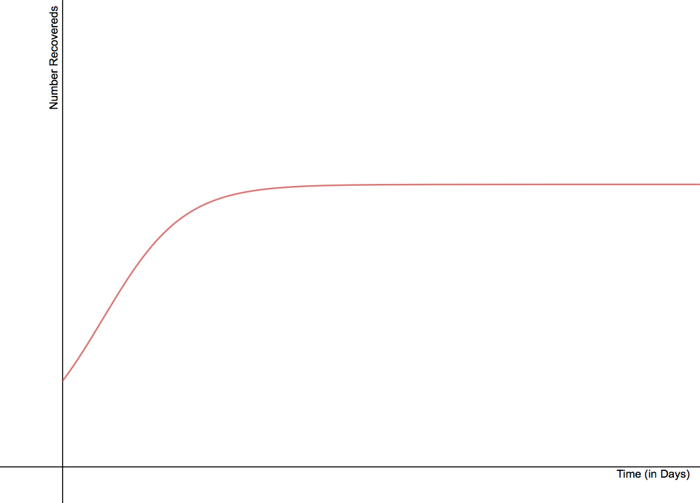
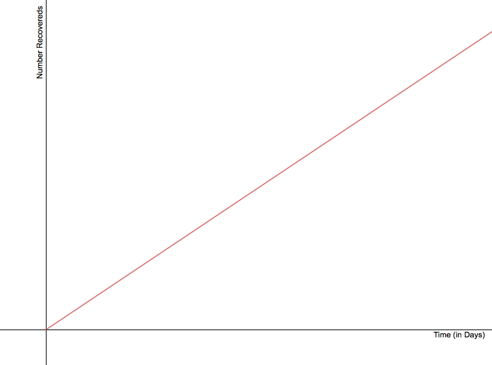

SIR
========================================================
author: Math 111
date: 
autosize: true

Logistics
===
Syllabus questions?

Homework:
  * Webwork
  * Survey
  * HW Set 1
  * Section numbers in text (on calendar)

<!--
A Quote
===
"The grading system for this calculus class is likely different than anything you have seen in your classes before. At first it will seem like the website used and the way grades are determined make no sense, but at the end of the class you will see the benefits. First of all, the Haiku website can prove to be more comprehensive than Sakai if you take a moment to figure it out. As for the grades themselves, everything is broken down into topics covered in the class. The rubric you received for your grades mentions these “learning goals” along with videos and labs. You have to master a set number of learning goals for an A, and certain numbers for lower grades. However, the beauty of the grading system is a balance between the learning goals, videos, labs, etc.

Continued
===
On tests and homework assignments, questions are designated with the associated learning goals, and correctly answering them will lead you to a mastery of that learning goal. When it comes time for the final, the exam is tailored to you specifically. Any learning goals you have already mastered will not be on the exam and you can choose the learning goals you want to still master to be included on the test. Focus on the learning goals, and don’t stress about the ones you don’t master. You will have an opportunity to do so. Do your assignments and study and you’ll do great. Take it from me, a student whose grade was a D- at midterms and an A- at finals, your grade can be saved."
-->

Graphing
===
Let's look at a graph of yesterday's data

Which of the following is a reasonable graph for R vs. t? Why? Why are the others NOT reasonable representations?
===
A

***

B

===
C

***
D

More graphs
===
* Now on paper, as a group, sketch possible graphs from S vs. t and I vs. t (on separate papers)
* What qualities did you need to ensure that your graphs had? Why?
* When you are done with the first two:
  * When will the R population be changing the fastest?
  * When will the S population be changing the fastest?
  
Factors
===
We discussed important features of our model. How do S, I, and R relate to each other?

Scenario 1
===
Suppose that the city's Board of Health reports that the measles infection has been spreading at the rate of 470 new cases per day for the last several days. 

If that rate continues to hold steady and our population starts with 20,000 susceptible people, determine the following:
* What will the size of the susceptible population be in 4 days? 
* How many new infections have occurred in these 4 days? 
* How many susceptibles were there 2 days ago?

Go deeper: express the susceptible population in terms of d, the number of days from today (i.e., $d=1$ is tomorrow, $d=-1$ is yesterday)

Scenario 2
===
Now, assume that in our of a population of 20,000 people, 940 are infected. Each day, about half of the infected population infects one susceptible.
* How many new infections occur on the first day?
* How many new infections occur from day 1 to day 2?
* How many new infections occur from day 2 to day 3?
* What are the challenges to writing a formula for the susceptible population?

Compare and Contrast
===
* How does scenario 1 relate to scenario 2? What is similar? What is different?
* Which one do you think is a better representation of the actual behavior of the infection?

Rates
===
* Both scenarios involve a rate.
  * Scenario 1: Constant rate
  * Scenario 2: Changing rate
* Which was more realistic?
* Goal: Find a mathematical expression

Notation
===
* $S(d)$, $I(d)$, and $R(d)$ are the **number** of susceptible, infected, and recovered people on day $d$
* $S'(d)$ is the rate at which the population of susceptibles is changing
* $I'(d)$ is the rate at which the population of infecteds is changing
* $R'(d)$ is the rate at which the population of recovereds is changing

S’(d), I’(d), R’(d) may change over time!

Rate of Recovery
===
incremental:true
* $R'(d)$: This seems complicated - how can we simplify the "3 day recovery rule"?
* What if we assume 1/3 of the current infected population recovers each day?

* Suppose $I(4) = 2100$ people
  * What would $R'(5)$ be?
  * What would $R(5)$ be?
  * What would $I(5)$ be?
* Write a mathematical expression for $R'(d)$

Rate of Transmission
===
* $S'(t)$
* What factors affect rate of disease transmission?
* Simple scenario:
  * 5 healthy people
  * 3 sick people
  * Interaction always leads to infection
* How many possible interactions are there between a healthy person and a sick person?
* How many people will get sick during day 1?
* What factors influence this?

Rate of Transmission
===
* $S'(t)$
* What factors affect rate of disease transmission?
* Simple scenario:
  * 5 healthy people
  * 3 sick people
  * Interaction always leads to infection
* How many possible interactions are there between a healthy person and a sick person?
* How many people will get sick during day 1?
* What factors influence this?
* What if 1/3 of interactions leads to infection?
* Write a mathematical expression

Notation
===
* S*I = the total number of possible "interactions" between healthy and sick people if there are S susceptibles and I infecteds
* p = proportion of interactions that actually happen in a day
* q = probability an interaction infects a susceptible.
* pSI = number of interactions that *occur*
* qpSI = number of new sick people

* a=qp 
* a is the "transmission coefficient""

Full model
===
$S'(t) = -a S(t) I(t)$

$I'(t) = a S(t) I(t)-b I(t)$

$R'(t) = b I(t)$

Using a spreadsheet
===
Let's use a spreadsheet to start to model this

Checking in
===
Questions?

Measles
===
incremental:true
Say we have found data from past measles epidemics and have determined that $a = 0.00001$ and $b = \frac{1}{14}$.

What are the rate equations?

Based on these numbers, how many days does it take to recover from the measles?

Additionally, assume that we start with 45400 susceptibles, 2100 infecteds, and 2500
recovereds when t = 0 days.

BY HAND:
===
- Initially, what are the values for $S'$, $I'$, and $R'$? (Including units)
- Based on our rate equations, how many susceptibles, infecteds, and recovereds will there be in one day (when $t = 1$)?
- What are the values for $S'$, $I'$, and $R'$ when $t = 1$ day?
- Based on our rate equations, how many susceptibles, infecteds, and recovereds will there be in two days, when $t = 2$?

Table
===
Continue the calculations by filling in the following table.

| t | S | I | R | S' | I' | R' |
|:-:|:-:|:-:|:-:|:--:|:--:|:--:|
| 0 |   |   |   |    |    |    |
| 1 |   |   |   |    |    |    |
| 2 |   |   |   |    |    |    |
| 3 |   |   |   |XX  |XX  |XX  |

What does this buy us?
===
- It's a simple model, but it's a good place to start from.
- Can give us both qualitative and quantitative data

Spreadsheet
===
Build the same model using a spreadsheet

There and Back Again
===
incremental:true
- We start with 45400 susceptibles, 2100 infecteds, and 2500 recovereds. Using the rate
equations, what do you think will be the result of projecting forward one day to find
the populations, and then projecting backwards one day?
- Numerically project forward a day and back a day. Does the result match your pre-
diction? Why or why not?
- Why do we not get the size of our initial populations when we step forward and
backward?
- Now project forward 2 days using our rate equations and backward two days using our
rate equations. What do you notice? How do your results relate to the results in the
previous part?

Errors
===

Why does it matter how we handle the "2 days" question?

Step Sizes
===
- What other step sizes could we use besides 2 days?
- Does it make a difference? If so - why and how?
- Try the questions using a step size of half a day.

Euler's method
===
This method is called "Euler's method" (after Leonhard Euler)

It works for any size of steps

Slopes as Multipliers
===
How are the changes ($\Delta$'s) related to the derivatives: $S'(d)$, $R'(d)$, $I'(d)$?

General functions
===
What if we know a general function value $f(a)$ (at a single point), and we can figure out $f'(t)$ at any value? What does this buy us?

A New Model
===
* Suppose $P(t)$ is a population of bunnies.
* At any point in time, the population is growing at a rate following the equation $P'(t) = 0.2 P(t)$.
* There are 100 bunnies initially.
* How many bunnies will there be in 4 months?
